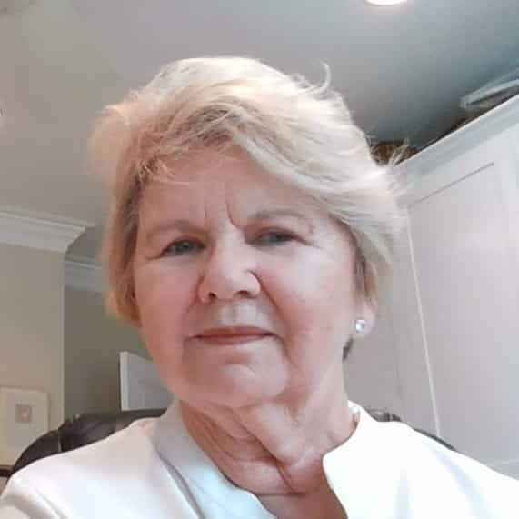

Georgia is a Liscensed Associate Porfessional Counselor whose special interest is in working with couples where “life” has gotten in the way of staying connected. She is trained in Gottman’s Couples Therapy which is a research-based approach to working with couples who would like to help re-connecting with their partner. Georgia also works with people who struggle with feeling overwhelmed by daily life resulting in anxieties and depression. Her approach is to create a safe space for those individuals to acknowledge their personal challenges without judgement and then strength their emotional well-being. I any of this describes your situation, let Georgia partner with you to help create the best version of yourself and provide objective support as you navigate the challenges you face.  